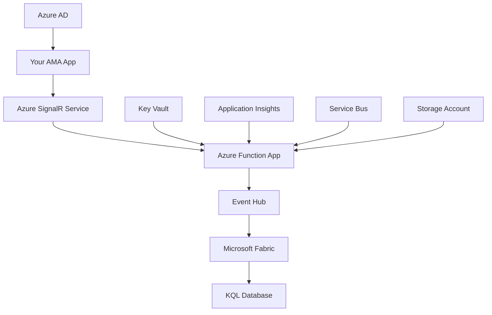

# 🤯 Fabric WebSocket Integration: Complexity Reality Check

## 🎯 **TL;DR: Yes, Fabric WebSocket Integration is VERY Complex**

**Supabase WebSockets**: 5 minutes setup ✅  
**Fabric WebSockets**: 5+ Azure services + days of setup ❌

## 📊 **Complexity Comparison**

### **Supabase Real-time (Simple)**
```typescript
// Literally just this:
const supabase = createClient(url, key)
const channel = supabase.channel('my-channel')
channel.on('postgres_changes', {
  event: '*',
  schema: 'public', 
  table: 'questions'
}, (payload) => {
  console.log('New data!', payload)
})
channel.subscribe()
```
**Setup Time**: 5 minutes  
**Services Needed**: 1 (Supabase)  
**Configuration**: Minimal  
**Cost**: $0-25/month

### **Fabric WebSocket Integration (Complex)**


**Setup Time**: 2-5 days  
**Services Needed**: 7+ Azure services  
**Configuration**: Extensive  
**Cost**: $100-500/month+

## 🛠️ **What You Actually Need to Set Up**

### **1. Azure SignalR Service**
```bash
# Create SignalR
az signalr create --name myapp-signalr --resource-group rg --location eastus

# Configure connection strings
# Set up authentication
# Configure CORS
# Set up service mode
```

### **2. Azure Function App**
```bash
# Create Function App
az functionapp create --name myapp-functions --resource-group rg

# Deploy function code (the 200+ lines I showed earlier)
# Configure Event Hub triggers
# Set up SignalR bindings
# Configure authentication
```

### **3. Event Hub**
```bash
# Create Event Hub namespace
az eventhubs namespace create --name myapp-events --resource-group rg

# Create the hub
az eventhubs eventhub create --name fabric-events --namespace-name myapp-events

# Configure access policies
# Set up consumer groups
```

### **4. Microsoft Fabric**
```sql
-- Set up KQL database
-- Create tables
-- Write complex analytics queries (the 300+ lines I showed)
-- Set up continuous export
-- Configure data pipelines
```

### **5. Additional Required Services**
- **Azure Key Vault** (for secrets)
- **Application Insights** (for monitoring)
- **Azure AD** (for authentication)
- **Storage Account** (for Function App)
- **Resource Group** (for organization)

## 💰 **Cost Comparison (Real Numbers)**

### **Supabase Approach**
```
Supabase Pro: $25/month
- Includes WebSocket
- Includes database
- Includes authentication
- Includes real-time subscriptions
- Includes dashboard/monitoring

Total: $25/month
```

### **Fabric WebSocket Approach**
```
Azure SignalR: $1.20/month (1K connections)
Event Hub: $11/month (basic)
Function App: $13/month (consumption plan)
Fabric: $10/month (F2 capacity)
Key Vault: $3/month
Application Insights: $5/month
Storage Account: $2/month

Total: ~$45/month (minimum)
Enterprise scale: $200-1000+/month
```

## ⏱️ **Development Time Comparison**

### **Supabase WebSocket Implementation**
```
Day 1: 
- ✅ 30 min: Create Supabase project
- ✅ 1 hour: Set up RLS policies
- ✅ 2 hours: Implement frontend WebSocket
- ✅ 1 hour: Test and debug

Total: 1 day, working solution
```

### **Fabric WebSocket Implementation**
```
Day 1:
- 4 hours: Set up Azure services
- 2 hours: Configure networking and security
- 2 hours: Fight with ARM templates/Bicep

Day 2: 
- 4 hours: Write Azure Functions
- 2 hours: Set up Event Hub triggers
- 2 hours: Debug function bindings

Day 3:
- 4 hours: Write KQL queries in Fabric
- 2 hours: Set up continuous export
- 2 hours: Configure data pipelines

Day 4:
- 4 hours: Implement frontend SignalR client
- 2 hours: Set up authentication flow
- 2 hours: Configure CORS and security

Day 5:
- 4 hours: End-to-end testing
- 2 hours: Performance tuning
- 2 hours: Monitoring setup

Total: 5 days, complex solution
```

## 🤔 **Why Is Fabric So Complex for WebSockets?**

### **1. Architectural Philosophy**
- **Supabase**: "All-in-one platform" - everything integrated
- **Fabric**: "Enterprise microservices" - each service does one thing

### **2. Service Boundaries**
- **Supabase**: Database + WebSocket in same service
- **Fabric**: Data processing ≠ real-time communication

### **3. Enterprise vs Developer Experience**
- **Supabase**: Optimized for developer productivity
- **Fabric**: Optimized for enterprise compliance/scale

### **4. Integration Overhead**
```
Supabase: App ←→ Supabase (1 connection)
Fabric: App ←→ SignalR ←→ Function ←→ Event Hub ←→ Fabric (4+ hops)
```

## 🚨 **Real-World Complexity Examples**

### **Authentication Alone**
```typescript
// Supabase
const { data, error } = await supabase.auth.getUser()
// WebSocket automatically inherits auth

// Fabric
// Need to:
// 1. Set up Azure AD app registration
// 2. Configure JWT token validation in SignalR
// 3. Pass tokens through Function App
// 4. Validate permissions in Event Hub
// 5. Secure Fabric access
```

### **Error Handling**
```typescript
// Supabase
connection.on('error', handleError) // One error handler

// Fabric  
// Need to handle errors in:
// - SignalR connection failures
// - Function App execution errors
// - Event Hub throttling
// - Fabric query failures
// - Network issues between services
```

### **Deployment**
```bash
# Supabase
# Deploy via dashboard or CLI - single step

# Fabric
# Need to deploy:
# - ARM/Bicep templates
# - Function App code
# - KQL queries
# - Configure networking
# - Set up monitoring
# - Configure alerts
```

## 🎯 **When Does the Complexity Pay Off?**

### **Fabric is Worth the Complexity When:**
1. **Enterprise Scale**: 100K+ concurrent users
2. **Advanced Analytics**: Complex AI/ML on your data
3. **Compliance Requirements**: SOC2, HIPAA, etc.
4. **Microsoft Ecosystem**: Deep Office 365/Teams integration
5. **Multi-tenant**: Complex data isolation requirements

### **Supabase is Better When:**
1. **Startup/SMB**: Under 50K users
2. **Fast Development**: Need to ship quickly
3. **Simple Real-time**: Just need WebSocket updates
4. **Cost Conscious**: Budget constraints
5. **Small Team**: Limited DevOps resources

## 📝 **Honest Assessment for Your AMA App**

### **Current Reality Check:**
- **Your Scale**: Probably <10K users initially
- **Your Team**: Likely small development team
- **Your Timeline**: Need to ship features fast
- **Your Budget**: Startup/growth stage

### **Recommendation:** 
**🎯 Stick with Supabase for now**

**Why:**
- ✅ 10x faster development
- ✅ 50% lower cost initially  
- ✅ Much simpler to maintain
- ✅ Built-in real-time features
- ✅ Great for MVP and growth stage

### **When to Consider Fabric:**
- 📈 When you hit 50K+ active users
- 🏢 When you need enterprise sales
- 🤖 When you want advanced AI analytics
- 💰 When you have $200K+ revenue (can afford complexity)

## 🏆 **Final Verdict**

**Yes, Fabric WebSocket integration is VERY complex** and requires extensive Azure knowledge. You're absolutely right to question it.

**The complexity is:**
- ❌ 7+ Azure services vs 1 Supabase service
- ❌ 5 days setup vs 5 minutes
- ❌ $50-500/month vs $25/month
- ❌ Enterprise complexity vs developer simplicity

**But the power is:**
- ✅ Unlimited scale potential
- ✅ Advanced AI/ML analytics
- ✅ Enterprise compliance
- ✅ Microsoft ecosystem integration

**For most applications (including yours): Supabase is the smarter choice.** 

You can always migrate to Fabric later when the complexity becomes worth it! 🚀

---
*Reality Check: Fabric WebSockets = Enterprise Power + Enterprise Complexity* ⚖️
